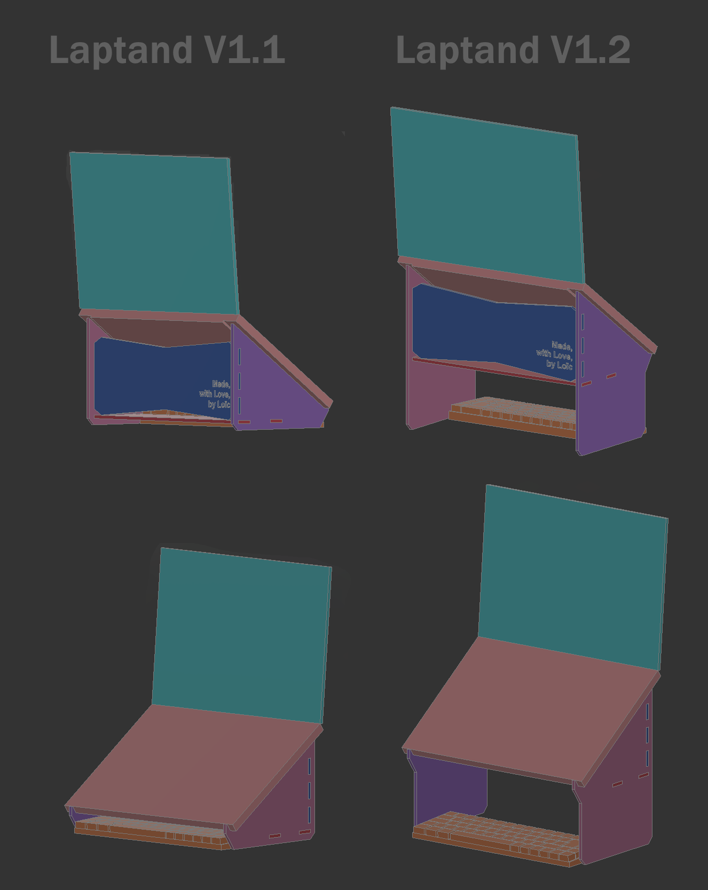
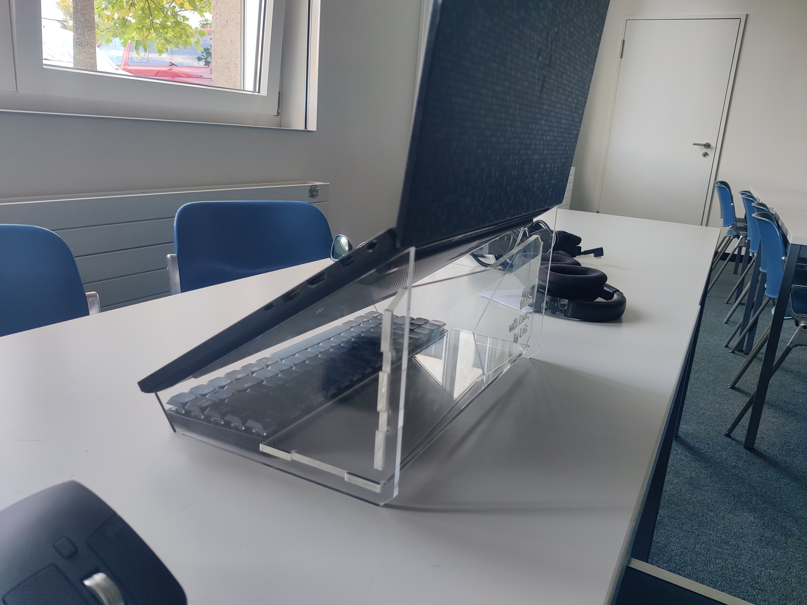
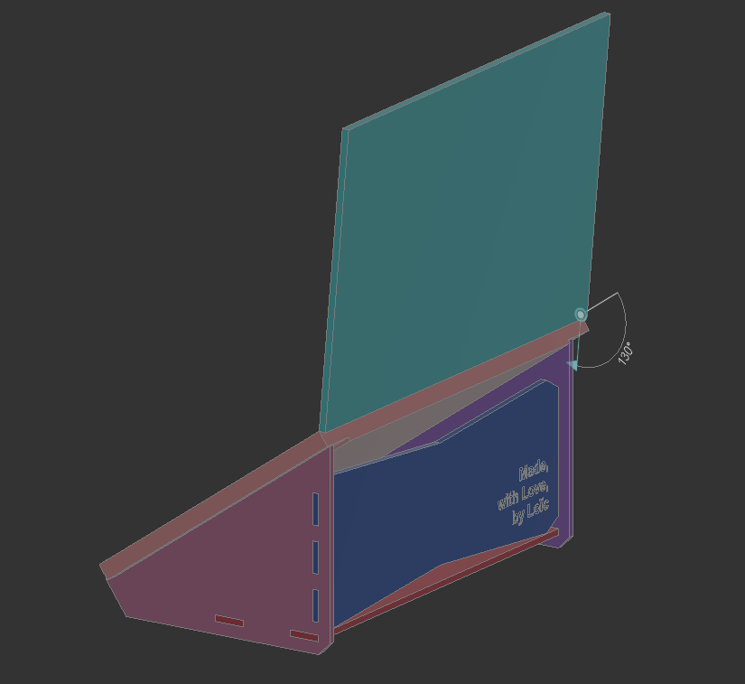
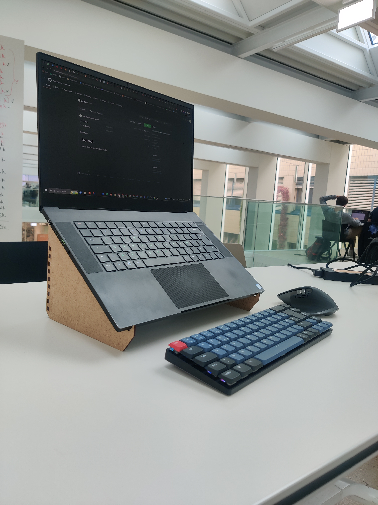
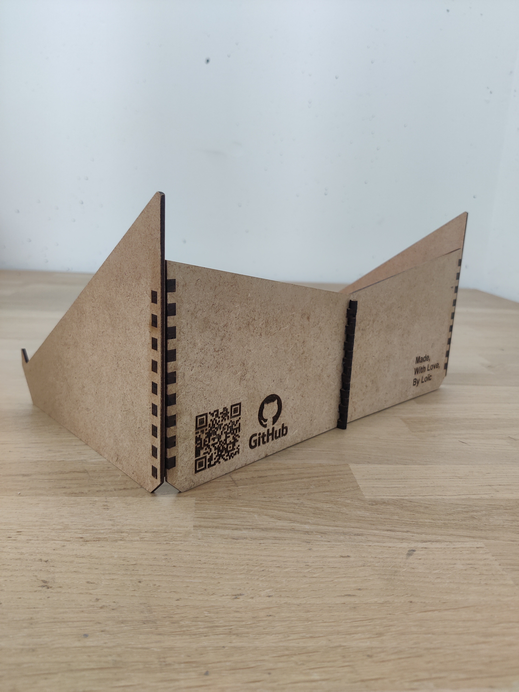
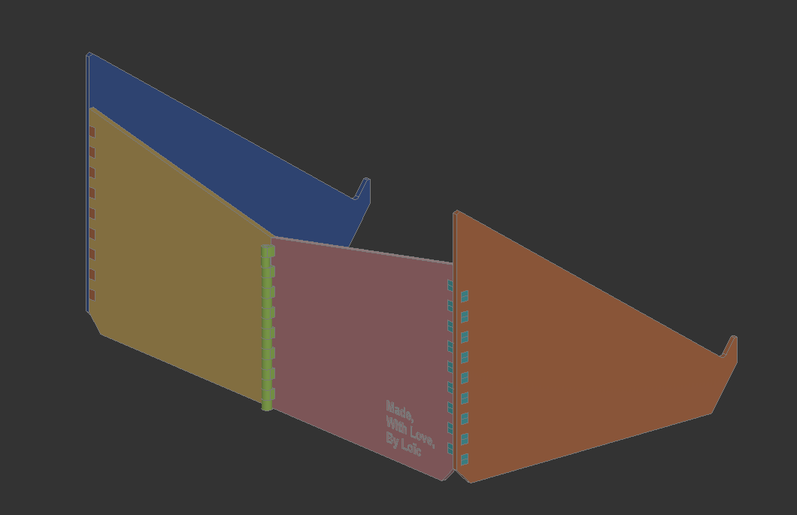
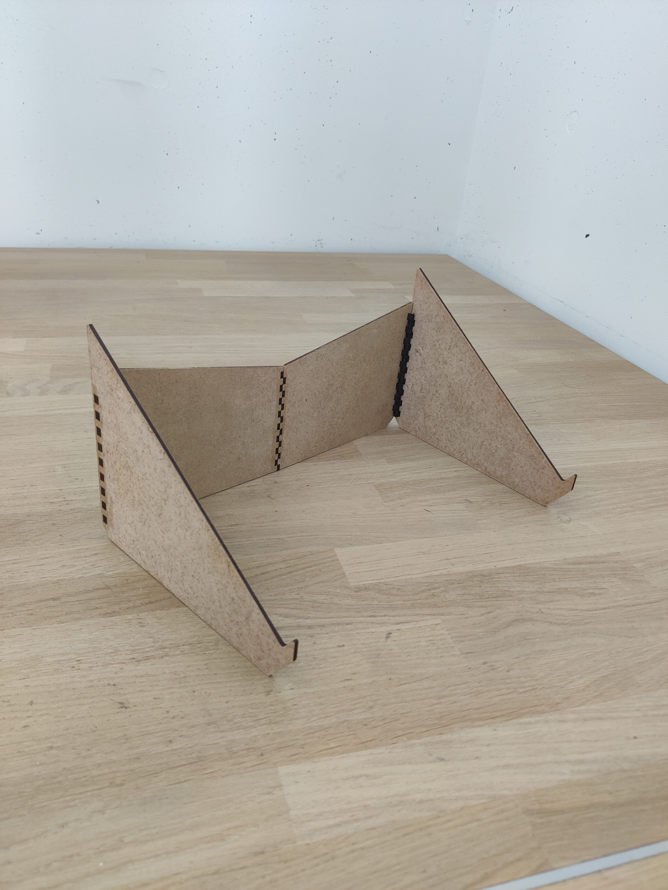

# Laptand
Laptop Stand to Keep Your Back Heathy

## Laptand V1 - Deprecated
Before making [Laptand V2](/Laptand_V2/README.md), I started with [Laptand V1.1](/Laptand_V1.1/README.md) and then [Laptand V1.2](/Laptand_V1.2/README.md) which improved on Laptand V1.1 as it lifted the computer another 120mm higher which let you use the keyboard under the computer.
 

    

Both of these Laptop Stands are assembled with finger joints that are a press-fit into the mating part. 

    

This proved to be very tedious to assemble and dissassemble, in addition to being prone to cracking if made out of PMMA.

    

    

Laptand V2 improves on this as it folds away in under a second, is made out of 3mm MDF and doesn't need daily assembly once built. 

## Laptand V2

    

    

    

    

    

### [Assembly Instructions for Laptand V1.2](/Laptand_V1.1/README.md)
### [Assembly Instructions for Laptand V1.1](/Laptand_V1.2/README.md)
### [Assembly Instructions for Laptand V2](/Laptand_V2/README.md)

